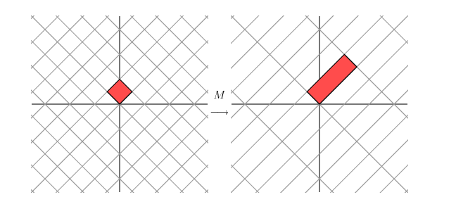

.. _svd:

奇异值分解（Singular Value Decomposition）
============================================

笔记参考自：`奇异值分解（We Recommend a Singular Value Decomposition） <http://www.flickering.cn/%E6%95%B0%E5%AD%A6%E4%B9%8B%E7%BE%8E/2015/01/%E5%A5%87%E5%BC%82%E5%80%BC%E5%88%86%E8%A7%A3%EF%BC%88we-recommend-a-singular-value-decomposition%EF%BC%89//>`_

线性变换的几何解释
^^^^^^^^^^^^^^^^^^^^^

首先，我们来看一个只有两行两列的简单矩阵。

.. math::

	\begin{equation}
	\mathbf{M}=
	\begin{bmatrix}
	2 & 1 \\
	1 & 2 \end{bmatrix} 
	\nonumber
	\end{equation}

从几何的角度，矩阵可以描述为一个变换：用矩阵乘法将平面上的点 :math:`(x,y)` 变换成另外一个点 :math:`(2x+y,x+2y)` :

.. math::

	\begin{equation}
	\begin{bmatrix}
	2 & 1 \\
	1 & 2 \end{bmatrix} 
	\begin{bmatrix}
	x \\
	y \end{bmatrix} 
	=
	\begin{bmatrix}
	2x+y \\
	x+2y \end{bmatrix} 
	\nonumber
	\end{equation}

这种变换的效果如下：

不过这张图貌似也并没有能够简洁、清晰的描述出上述矩阵变换的几何效果。然而，如果我们把网格旋转45度，再观察一下。

我们看到现在这个新的网格在某一方向上被拉伸了3倍。

如果我们有一个2*2的对称矩阵，可以证明，我们总是可以通过在平面上旋转网格，使得矩阵变换的效果恰好是在两个垂直的方向上对网格的拉伸或镜面反射。

即给定一个对称矩阵 :math:`M` ，我们可以找到一组正交向量 :math:`v_i` 使得 :math:`Mv_i` 等于 :math:`v_i` 和标量的乘积；那就是

.. math::

	Mv_i = \lambda_i v_i

这里 :math:`\lambda_i` 是标量。从几何意义上讲，这意味着当 :math:`v_i` 乘上矩阵 :math:`M` 时被简单地拉伸或者反射了。因为这个性质，我们称 :math:`v_i` 是 :math:`M` 的特征向量；标量 :math:`\lambda_i` 被称为特征值。一个可以被证明的重要的事实是：对称矩阵不同的特征值对应的特征向量是正交的。如果我们把对称矩阵的特征向量和网格对齐，那么矩阵对网格的拉伸或反射的方式，与矩阵对特征向量的拉伸或反射的方式，两者是完全一致的。

线性变换的详细介绍见 `上文 <./lineartransform.html>`_。

奇异值分解
^^^^^^^^^^^^^^^^

2*2矩阵奇异值分解的几何实质是：对于任意2*2矩阵，总能找到某个正交网格到另一个正交网格的转换与矩阵变换相对应。

用向量解释这个现象：选择适当的正交的单位向量 :math:`v_1` 和 :math:`v_2` ，向量 :math:`Mv_i` 和 :math:`Mv_2` 也是正交的。

.. image:: ./images/svd3.png

用 :math:`u_1` 和 :math:`u_2` 来表示 :math:`Mv_1` 和 :math:`Mv_2` 方向上的单位向量。 :math:`Mv_1` 和 :math:`Mv_2` 的长度用 :math:`\sigma_1` 和  :math:`\sigma_2` 来表示——量化了网格在特定方向上被拉伸的效果。 :math:`\sigma_1` 和  :math:`\sigma_2` 被称为 :math:`M` 的奇异值。

由此，我们有

.. math::
	
	Mv_1 = \sigma_1 u_1

	Mv_2 = \sigma_2 u_2

因为向量 :math:`v_1` 和 :math:`v_2` 是正交的单位向量，我们有

.. math::
	
	x = (v_1 \cdot x)v_1 + (v_2 \cdot x)v_2
	
:math:`v_1 \cdot x` 为单位向量与向量的内积，表示向量在该单位向量方向上的投影。

则有：

.. math::
	
	Mx = (v_1 \cdot x)Mv_1 + (v_2 \cdot x)Mv_2

	Mx = (v_1 \cdot x)\sigma_1 u_1 + (v_2 \cdot x)\sigma_2 u_2

注意点积（标量）可以用向量的转置来计算:

.. math::

	v \cdot x = v^T x

又有：

.. math::

	Mx = u_1\sigma_1 v_1^T x + u_2\sigma_2 v_2^T x 

	M = u_1\sigma_1 v_1^T + u_2\sigma_2 v_2^T

通常表述成

.. math::

	M = UΣV^T

则有：

.. math::

	M^T M = V(Σ^T Σ)V^T

	MM^T=U(ΣΣ^T)U^T 

这里 :math:`U` 是列向量 :math:`u_1` 和 :math:`u_2` 组成的矩阵， :math:`Σ` 是非零项为 :math:`\sigma_1` 和 :math:`\sigma_2` 的对角矩阵， :math:`V` 是列向量 :math:`v_1` 和 :math:`v_2` 组成的矩阵。

上面描述了怎样将矩阵 :math:`M` 分解成三个矩阵的乘积： :math:`V` 描述了原始空间中的正交基， :math:`U` 描述了相关空间的正交基， :math:`Σ` 描述了 :math:`V` 中的向量变成 :math:`U` 中的向量时被拉伸的倍数。

例：数据压缩
^^^^^^^^^^^^^^^

奇异值分解可以高效的表示数据。例如，假设我们想传送下列图片，包含15*25个黑色或者白色的像素阵列。

.. image:: ./images/svd_example1.png

因为在图像中只有三种类型的列（如下），它可以以更紧凑的形式被表示。

我们用15*25的矩阵来表示这个图像，其中每个元素非0即1，0表示黑色像素，1表示白色像素。如下所示，共有375个元素。

.. image:: ./images/svd_example3.png

如果对M进行奇异值分解的话，我们只会得到三个非零的奇异值。

.. math::
	
	\sigma_1 = 14.72

	\sigma_2 = 5.22

	\sigma_3 = 3.31

因此，矩阵可以如下表示

.. math::

	M = u_1\sigma_1 v_1^T + u_2\sigma_2 v_2^T + u_3\sigma_3 v_3^T 

我们有三个包含15个元素的向量 :math:`v_i` ，三个包含25个元素的向量 :math:`u_i` ，以及三个奇异值 :math:`\sigma_i` 。这意味着我们可以只用123个数字就能表示这个矩阵而不是出现在矩阵中的375个元素。在这种方式下，我们看到在矩阵中有3个线性独立的列，也就是说矩阵的秩是3。
